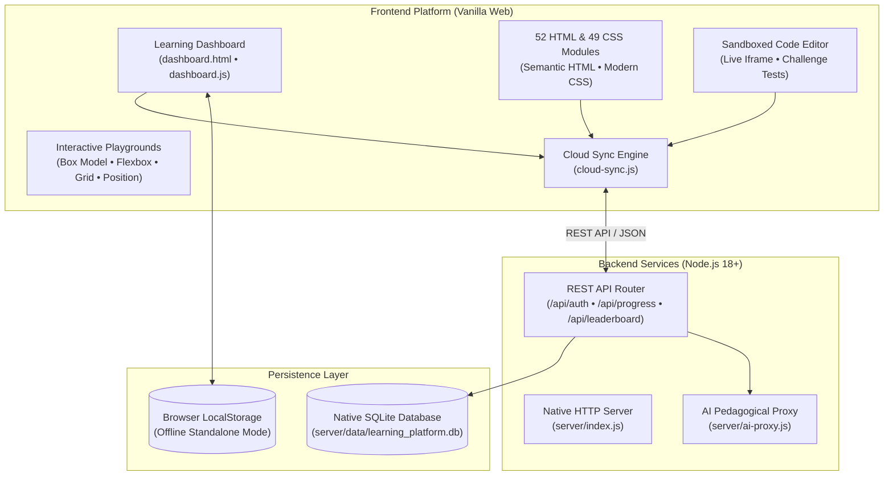

# 🚀 Full Stack Web Development Mastery Platform

[](https://abhimanyu1502.github.io/full-stack-web-dev-course/html-mastery/dashboard.html)
[](https://nodejs.org/)
[](https://developer.mozilla.org/en-US/docs/Web/JavaScript)
[](https://developer.mozilla.org/en-US/docs/Web/HTML)
[](https://developer.mozilla.org/en-US/docs/Web/CSS)
[](https://www.sqlite.org/)
[](html-mastery/LICENSE)

An interactive, production-grade web development learning platform designed to teach modern frontend and fullstack fundamentals through active practice.

---

## 🌐 Direct Live Website Links

You can access and test the entire platform directly in your browser without any installation:

| Section | Direct Link | Description |
| :--- | :--- | :--- |
| 📊 **Learning Dashboard** | [**Launch Dashboard →**](https://abhimanyu1502.github.io/full-stack-web-dev-course/html-mastery/dashboard.html) | Gamified learning center with daily goals, streak tracker, XP progression, and cloud sync |
| 🎨 **Interactive CSS Playgrounds** | [**Open Playgrounds →**](https://abhimanyu1502.github.io/full-stack-web-dev-course/html-mastery/playgrounds.html) | Real-time visualizers for CSS Box Model, Flexbox alignments, CSS Grid, and Positioning |
| 📖 **Course Curriculum & Modules** | [**Browse Topics →**](https://abhimanyu1502.github.io/full-stack-web-dev-course/html-mastery/introduction.html) | 52 comprehensive HTML modules & 49 CSS interactive lessons |
| 💻 **Practice Projects & Portfolio** | [**View Projects →**](https://abhimanyu1502.github.io/full-stack-web-dev-course/html-mastery/projects.html) | Step-by-step full projects with automated testing and code submissions |

---

## 🌟 Platform Highlights

- **52 Deep-Dive HTML Modules**: Semantic HTML5, form validations, multimedia, Canvas, SVG, Web Components, and accessibility (WCAG 2.1 AA compliant, ARIA patterns).
- **49 CSS Lessons & Interactive Visualizers**: Layout engines (Flexbox, CSS Grid, Multi-column), modern typography, transitions, animations, and custom property design systems.
- **4 Live CSS Playgrounds**: Hands-on interactive sandboxes allowing learners to visually manipulate box models, grid areas, flexbox axes, and positioning schemes in real time.
- **Sandboxed Code Sandbox**: In-browser code editor with instant live preview, syntax error reporting, automated challenge validation, and progressive hints.
- **Gamified Learning & Motivation**: XP level progression, streak counter, daily learning goal, challenge of the day, bookmarks, and focus mode.
- **Fullstack Node.js + SQLite Backend**: Native RESTful API (`/api/auth`, `/api/progress`, `/api/leaderboard`, `/api/snippets`, `/api/ai`) with zero external native dependencies.
- **AI Pedagogical Tutor**: Contextual code analysis, progressive hints, and debugging assistance powered by Gemini with offline heuristic fallbacks.
- **100% Responsive & Accessible**: Tested on screens from 320px to 1440px+, fully keyboard navigable, and respects prefers-reduced-motion.

---

## 🏗️ Fullstack Architecture



---

## 🚀 Local Quickstart

### Prerequisites
- [Node.js](https://nodejs.org/) version **18.0.0 or higher** (Node.js 22+ recommended for native SQLite)

### 1. Clone the Repository
```bash
git clone https://github.com/abhimanyu1502/full-stack-web-dev-course.git
cd full-stack-web-dev-course/html-mastery
```

### 2. Start the Fullstack Server
No `npm install` required! Start the platform immediately:
```bash
npm start
```

### 3. Open in Browser
Navigate to:
```
http://localhost:5000/dashboard.html
```

---

## 🧪 Automated Test Suite

Run the full regression test suite (150 automated checks covering HTML5 markup, CSS tokens, WCAG AA accessibility, iframes, and SQLite database operations):

```bash
npm test
```

Expected output:
```text
====================================================
   TEST SUITE: HTML & CSS MASTERY FULLSTACK PLATFORM  
====================================================

--- 1. Verifying All HTML Routes & Links ---
  [PASS] HTML Document valid: accessibility.html
  ...
--- 7. Verifying Backend & SQLite Database ---
  [PASS] Database module loaded
  [PASS] Native SQLite engine is available and active
  [PASS] Demo user alex_frontend authenticated via SQLite
  [PASS] Leaderboard returns top learners (Found 5)
  [PASS] Progress data successfully synced to SQLite

REGRESSION RESULTS: 150 passed, 0 failed out of 150 checks
>>> OVERALL REGRESSION STATUS: PASS <<<
```

---

## 📡 REST API Reference

The backend exposes the following RESTful endpoints on `http://localhost:5000/api`:

| Method | Endpoint | Description |
| :--- | :--- | :--- |
| `GET` | `/api/health` | Check server and SQLite database health status |
| `POST` | `/api/auth/register` | Register a new user account |
| `POST` | `/api/auth/login` | Login and receive a Bearer session token |
| `GET` | `/api/profile` | Retrieve user profile, XP, level, and streak count |
| `POST` | `/api/progress/sync` | Sync local progress state to SQLite database |
| `GET` | `/api/progress` | Pull cloud progress state to local device |
| `GET` | `/api/leaderboard` | View top learners in the community leaderboard |
| `POST` | `/api/snippets` | Save code snippet to personal cloud vault |
| `POST` | `/api/ai/ask` | Pedagogical code explanations and progressive hints |

---

## 📁 Repository Directory Structure

```text
full-stack-web-dev-course/
├── README.md                    # Main repository showcase & live demo links
├── index.html                   # Root entry redirect for GitHub Pages
├── html-mastery/                # Core fullstack web platform
│   ├── .github/workflows/ci.yml # GitHub Actions automated CI testing
│   ├── server/
│   │   ├── index.js             # Native Node.js HTTP server & REST APIs
│   │   ├── database.js          # Native SQLite database operations & schemas
│   │   └── ai-proxy.js          # AI tutor endpoint & pedagogical heuristics
│   ├── tests/
│   │   └── regression-suite.test.js # 150 automated regression tests
│   ├── dashboard.html           # Gamified learning dashboard
│   ├── playgrounds.html         # Interactive CSS visualizer playgrounds
│   ├── cloud-sync.js            # Frontend client for SQLite sync & auth
│   ├── progress.js              # XP, streak, bookmark, and progress engine
│   ├── editor.js                # Sandboxed live code sandbox
│   ├── styles.css               # Design system & responsive tokens
│   ├── package.json             # NPM scripts & metadata
│   └── LICENSE                  # MIT Open Source License
```

---

## 📄 License

Distributed under the MIT License. See [`LICENSE`](html-mastery/LICENSE) for details.

Developed with ❤️ by [**Abhimanyu**](https://github.com/abhimanyu1502)
