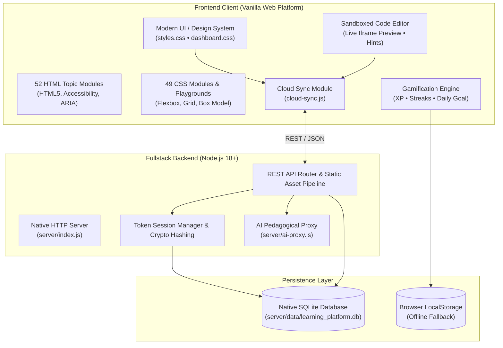

# 🚀 HTML & CSS Mastery — Fullstack Interactive Learning Platform

[](https://nodejs.org/)
[](https://developer.mozilla.org/en-US/docs/Web/JavaScript)
[](https://developer.mozilla.org/en-US/docs/Web/HTML)
[](https://developer.mozilla.org/en-US/docs/Web/CSS)
[](https://www.sqlite.org/)
[](https://abhimanyu1502.github.io/full-stack-web-dev-course/html-mastery/dashboard.html)
[](LICENSE)

> ### 🌐 **Live Website Direct Access**
> **👉 Launch Learning Platform:** [https://abhimanyu1502.github.io/full-stack-web-dev-course/html-mastery/dashboard.html](https://abhimanyu1502.github.io/full-stack-web-dev-course/html-mastery/dashboard.html)  
> **🎨 Interactive CSS Playgrounds:** [https://abhimanyu1502.github.io/full-stack-web-dev-course/html-mastery/playgrounds.html](https://abhimanyu1502.github.io/full-stack-web-dev-course/html-mastery/playgrounds.html)  
> **📖 Course Curriculum:** [https://abhimanyu1502.github.io/full-stack-web-dev-course/html-mastery/introduction.html](https://abhimanyu1502.github.io/full-stack-web-dev-course/html-mastery/introduction.html)  
> **🚀 Practice Projects & Solutions:** [https://abhimanyu1502.github.io/full-stack-web-dev-course/html-mastery/projects.html](https://abhimanyu1502.github.io/full-stack-web-dev-course/html-mastery/projects.html)  

An interactive, production-grade web development learning platform designed to teach modern frontend fundamentals through active practice. Features **52 deep-dive HTML modules**, **49 CSS topics**, **interactive visual playgrounds**, a **sandboxed live code editor**, a **gamified XP and streak engine**, an **AI coding tutor**, and a **lightweight Node.js + SQLite backend** for cloud progress syncing and community leaderboards.

---

## 🌟 Key Highlights

- **Zero-Dependency Architecture**: Runs completely natively using Node.js built-in modules (`http`, `crypto`, `node:sqlite`). Clones and boots in seconds without `npm install` latency or external dependency vulnerabilities.
- **52 Deep-Dive HTML Modules**: Comprehensive curriculum spanning HTML5 semantics, input validation, media elements, SVG, Canvas, Web Components, and accessibility (WCAG AA, ARIA).
- **49 CSS Lesson Modules**: Interactive theory and live code demonstrations covering modern layout modes (Flexbox, CSS Grid), animations, transitions, custom properties, and responsive design.
- **4 Interactive Visual Playgrounds**: Hands-on visualizers for the Box Model, Flexbox alignments, CSS Grid areas, and CSS Positioning schemes with live property manipulation.
- **Sandboxed Code Sandbox**: Integrated code editor with live preview, real-time error diagnostics, automated solution verification, and multi-tier progressive hints.
- **Active Learning & Gamification**: Daily learning goals, challenge of the day, XP level progression, streak tracking, focus mode, and bookmarking.
- **Cloud Progress Sync & REST API**: Native SQLite database engine with secure user accounts, cross-device progress synchronization, code snippet vault, and real-time community leaderboard.
- **AI Pedagogical Tutor**: Context-aware code explanations, error debugging, and step-by-step guidance powered by Gemini with offline heuristic fallbacks.
- **100% Accessible & Responsive**: Fully responsive across mobile (320px–430px), tablet (768px), and desktop (1024px–1440px+). Adheres to WCAG 2.1 AA keyboard accessibility and reduced-motion preferences.

---

## 🏗️ System Architecture



---

## 🚀 Quickstart Guide

### Prerequisites
- [Node.js](https://nodejs.org/) **18.0.0 or higher** (Node.js 22+ recommended for native SQLite support)
- Modern web browser (Chrome, Edge, Firefox, Safari)

### 1. Clone the Repository
```bash
git clone https://github.com/YOUR_USERNAME/html-css-mastery-fullstack.git
cd html-css-mastery-fullstack
```

### 2. Start the Server
No `npm install` needed! Start the platform immediately:
```bash
npm start
```
*Alternatively, run in watch mode for development:*
```bash
npm run dev
```

### 3. Open in Browser
Open your browser and navigate to:
```
http://localhost:5000/dashboard.html
```

---

## 🧪 Automated Testing & Verification

The repository includes a comprehensive 150-point automated test suite validating routes, DOM compliance, iframe security sandboxing, CSS token integrity, responsive rules, SQLite persistence, and REST APIs:

```bash
npm test
```

Expected output:
```text
====================================================
   TEST SUITE: HTML & CSS MASTERY FULLSTACK PLATFORM  
====================================================

--- 1. Verifying All HTML Routes & Links ---
  [PASS] HTML Document valid: accessibility.html
  [PASS] Iframe sandboxed in buttons-and-links.html
  ...
--- 7. Verifying Backend & SQLite Database ---
  [PASS] Database module loaded
  [PASS] Native SQLite engine is available and active
  [PASS] Demo user alex_frontend authenticated via SQLite
  [PASS] Leaderboard returns top learners (Found 5)
  [PASS] Progress data successfully synced to SQLite

REGRESSION RESULTS: 150 passed, 0 failed out of 150 checks
>>> OVERALL REGRESSION STATUS: PASS <<<
```

---

## 📡 REST API Reference

The backend exposes a clean, modular RESTful API on `http://localhost:5000/api`:

| Method | Endpoint | Description | Auth Required |
| :--- | :--- | :--- | :---: |
| `GET` | `/api/health` | System health, database connection & uptime | No |
| `POST` | `/api/auth/register` | Register new user account (`username`, `email`, `password`) | No |
| `POST` | `/api/auth/login` | Login user and receive Bearer session token | No |
| `GET` | `/api/profile` | Retrieve profile metadata, level, XP, and streaks | Yes (Bearer) |
| `POST` | `/api/progress/sync` | Sync local progress state (XP, streaks, completed modules) | Yes (Bearer) |
| `GET` | `/api/progress` | Fetch cloud-persisted progress state | Yes (Bearer) |
| `GET` | `/api/leaderboard` | Retrieve top ranked learners sorted by XP | No |
| `POST` | `/api/snippets` | Save custom HTML/CSS code snippet to database | Yes (Bearer) |
| `GET` | `/api/snippets` | Retrieve learner's saved code snippets | Yes (Bearer) |
| `POST` | `/api/projects/submit` | Submit practice project code for showcase | Yes (Bearer) |
| `POST` | `/api/ai/ask` | Send code context to AI Tutor for hints or explanations | No |

---

## 📦 Project Structure

```text
html-mastery/
├── .github/
│   └── workflows/
│       └── ci.yml               # Automated GitHub Actions test pipeline
├── server/
│   ├── index.js                 # Native HTTP static server & REST API router
│   ├── database.js              # Native SQLite connection, schema & operations
│   ├── ai-proxy.js              # AI Tutor API endpoint with intelligent fallbacks
│   └── data/                    # SQLite database storage directory (git-ignored)
├── tests/
│   └── regression-suite.test.js # 150-assertion fullstack regression test suite
├── index.html                   # Platform landing & portal redirect
├── dashboard.html               # Gamified learning dashboard & progress center
├── dashboard.css                # Dashboard layout & widget styles
├── dashboard.js                 # Dashboard state manager & goal tracker
├── cloud-sync.js                # Frontend client for SQLite sync & leaderboard
├── progress.js                  # Cross-page progress tracking & XP engine
├── styles.css                   # Core design system & responsive utility tokens
├── editor.js                    # In-browser sandboxed code editor & runner
├── playgrounds.html             # Interactive CSS layout visualizers
├── playgrounds.js               # Visualizer logic (Flexbox, Grid, Box Model)
├── quiz-engine.js               # Interactive checkpoint quizzes
├── exercise.js                  # Code challenge test runner & hint system
├── .env.example                 # Environment variable templates
├── .gitignore                   # Production git exclusion patterns
├── package.json                 # Project configuration, scripts & metadata
├── LICENSE                      # MIT Open Source License
└── README.md                    # Project documentation & showcase
```

---

## 🌐 Deployment Options

### Option 1: Fullstack Deployment (Render / Railway)
To deploy both the frontend and the SQLite backend server:
1. Push this repository to GitHub.
2. Link the repository to [Render.com](https://render.com) or [Railway.app](https://railway.app).
3. Set the **Build Command** to: *(leave blank)*
4. Set the **Start Command** to: `npm start`
5. Configure environment variables (optional):
   - `PORT`: `5000`
   - `GEMINI_API_KEY`: *(Optional, for live Gemini AI tutor)*

### Option 2: Static Deployment (GitHub Pages)
If you prefer to showcase the frontend as a static website:
1. Go to **Settings** > **Pages** in your GitHub repository.
2. Select **Source** as `Deploy from a branch` (`main` / `root`).
3. Click **Save**. The frontend will automatically detect that it's running standalone and switch to `Local Mode (Offline)` with full client-side persistence via `localStorage`!

---

## 🤝 Contributing

Contributions, feedback, and suggestions are welcome!
1. Fork the repository
2. Create a feature branch (`git checkout -b feature/amazing-feature`)
3. Commit your changes (`git commit -m 'Add amazing feature'`)
4. Push to the branch (`git push origin feature/amazing-feature`)
5. Open a Pull Request

---

## 📄 License

Distributed under the MIT License. See [`LICENSE`](LICENSE) for details.

Developed with ❤️ by **Abhimanyu**
